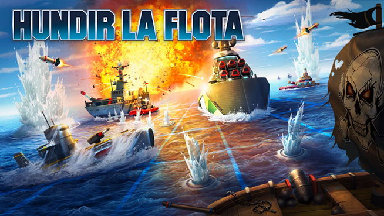

# 🚢 Hundir la Flota

<p aling="center">

</p>

---
Juego clásico de **Hundir la Flota** desarrollado en Python, jugable directamente desde la consola.

---

## 📋 Descripción

Hundir la Flota es un juego de estrategia por turnos donde el jugador se enfrenta contra el ordenador. Cada uno tiene un tablero con 6 barcos colocados de forma aleatoria:

* 3 barcos de eslora 2
* 2 barcos de eslora 3
* 1 barco de eslora 4

El objetivo es hundir todos los barcos del rival (ordenador) antes de que el rival hunda los tuyos.

El juego se desarrolla completamente en la consola, y muestra un menú con opciones para visualizar los tableros actualizados del jugador y del ordenador.

---

## 🎮 Cómo se juega

### Objetivo
Hundir todos los barcos del ordenador antes de que el ordenador hunda los tuyos.

### Inicio de la partida
1. Ejecuta el programa desde la consola, mediante el archivo menu.py
2. Los barcos se colocan automáticamente en el tablero al inicio de la partida.
3. Se muestran dos tableros:
   - **Tu tablero**: puedes ver tus propios barcos.
   - **Tablero del ordenador**: puedes ver los barcos del ordenador. Aunque el codigo de programacion puede ser modifcado para que no se muestre.

### Turnos
El juego inicia con el turno del jugador:

- **Turno del jugador**: ingresa las coordenadas donde quieres disparar, el formato de ingreso es "numero de fila. numero de columna", ejemplo: 4.5
- **Turno del ordenador**: el ordenador dispara automáticamente en una coordenada aleatoria.

> ⚡ Si un jugador acierta un disparo, vuelve a disparar hasta que falle.

### Resultado del disparo
- 💥 **Impacto**: el disparo ha dado en un barco.
- 🌊 **Agua**: el disparo ha fallado.

### Fin de la partida
- 🏆 **Ganas** si hundes todos los barcos del ordenador primero.
- 💀 **Pierdes** si el ordenador hunde todos tus barcos primero.

---

## ▶️ Ejecución

```bash
python menu.py
```

---

## 🛠️ Requisitos

- Python 3.x
- Numpy

---

## 📁 Estructura del proyecto

```
hundir-la-flota/
│
├── menu.py          # Punto de entrada, menú principal
├── main.py          # Flujo principal de inicion de juego
└── funciones.py     # Funciones auxiliares (tablero, disparos, vistas)

```

---

## 👨‍💻 Autor

**Nadia Llamoca** - Desarrollado como proyecto de aprendizaje en Python.

